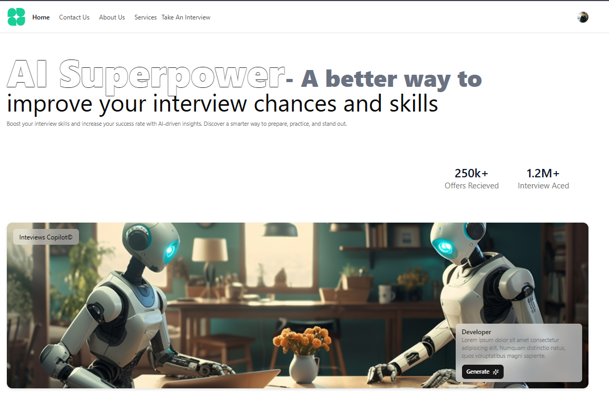
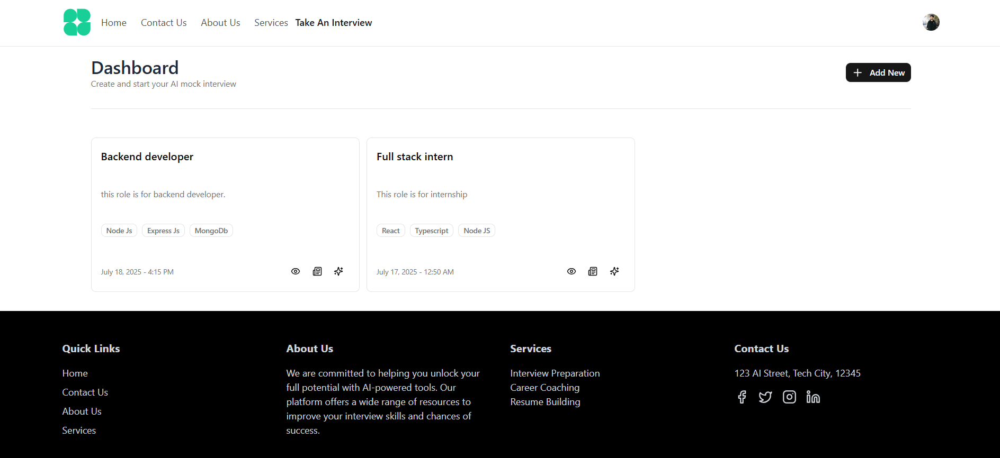
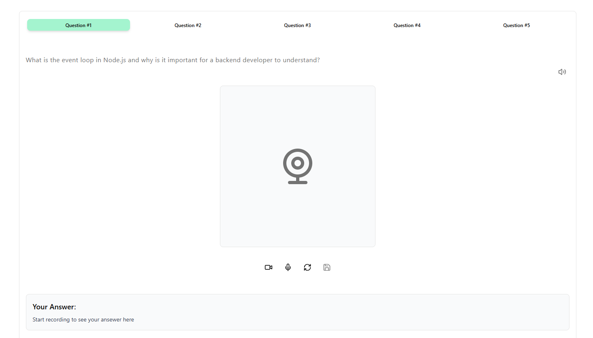
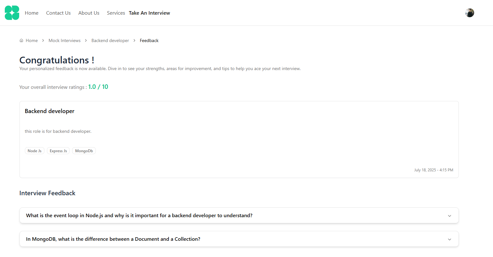
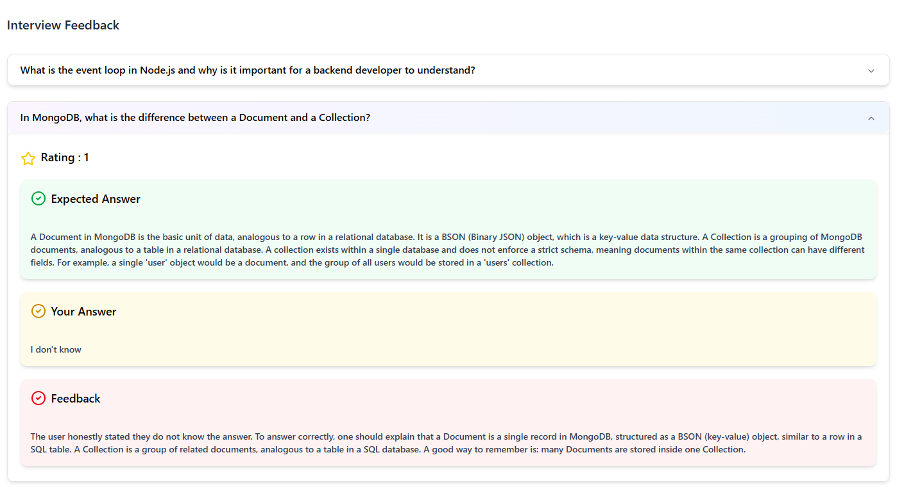

# 🧠 React AI Mock Interview Platform

An innovative web application that simulates real-world mock interviews using cutting-edge AI. Designed to empower job seekers, students, and professionals with personalized practice, instant feedback, and an intuitive experience — all in one place.

🌐 **Live Demo:** [Hosted on firebase](https://ai-mock-interview-56f69.web.app/)

---

## 🚀 Features

### 🤖 AI-Powered Mock Interviews

Simulate realistic interview scenarios powered by **Google Gemini AI**. Receive intelligent, context-aware feedback on your responses and continuously improve your interview performance.

### 🔐 Seamless Authentication

Secure sign-up and login using **Clerk**, including social authentication and robust session management.

### 🎯 Dynamic Interview Customization

Customize mock interviews based on:

* Job roles (Developer, Analyst, Designer, etc.)
* Interview type (Technical / Behavioral)

### 📊 Real-Time AI Insights

Get instant AI-driven feedback on:

* Verbal and written responses
* Technical accuracy
* Communication and soft skills

### 📁 Data Management with Firebase

All user data, interview history, analytics, and settings are securely stored and managed using **Firebase Firestore**.

### 🧩 Interactive Questionnaires

Engage with a wide variety of question formats:

* Multiple-choice questions (MCQs)
* Scenario-based questions
* Coding questions
* Voice-based responses

### 📈 User Dashboard

Track your growth with a personalized dashboard that displays:

* Past interview attempts
* Performance analytics
* Strengths and improvement areas

---

## 🧪 Tech Stack

| Layer          | Technology         |
| -------------- | ------------------ |
| Frontend       | React.js           |
| Authentication | Clerk              |
| UI Framework   | Shadcn UI          |
| Database       | Firebase Firestore |
| AI Integration | Google Gemini AI   |

---

## 🛠️ Setup & Installation

### 1️⃣ Clone the Repository

```bash
git clone https://github.com/your-username/mock-interview-platform.git
cd mock-interview-platform
```

### 2️⃣ Install Dependencies

```bash
npm install -g pnpm
pnpm install
```

### 3️⃣ Start the Development Server

```bash
pnpm run dev
```

### 4️⃣ Firebase Initialization

```bash
firebase init
```

### 5️⃣ Firebase Deployment

```bash
firebase deploy
```

### 6️⃣ Build the Project

```bash
pnpm run build
```

---

## 🔑 Environment Variables

Create a `.env` file in the root directory and configure the following:

```env
VITE_FIREBASE_API_KEY=YOUR_API_KEY_REF
VITE_FIREBASE_AUTH_DOMAIN=YOUR_API_KEY_REF
VITE_FIREBASE_PROJECT_ID=YOUR_API_KEY_REF
VITE_FIREBASE_STORAGE_BUCKET=YOUR_API_KEY_REF
VITE_FIREBASE_MESSAGING_SENDER_ID=YOUR_API_KEY_REF
VITE_FIREBASE_APP_ID=YOUR_API_KEY_REF
```

---

## 📸 Screenshots

All screenshots are available in the `output` folder.

### 🏠 Index Page


### 📊 Dashboard


### 🎙️ Interview Interface


### 📈 Result Page


### 🤖 AI Feedback

---

## 🧑‍💻 Author

**Harsh Garg**
Feel free to reach out for collaboration, feedback, or contributions.

---

## 📄 License

This project is licensed under the **MIT License**.

---

⭐ If you found this project helpful, don’t forget to give it a star on GitHub!
